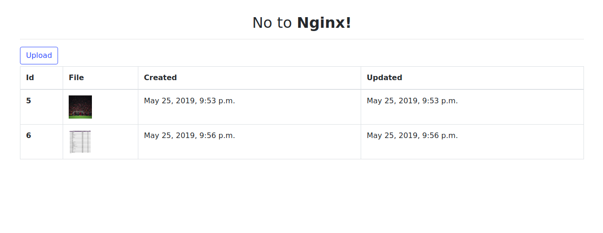

# No to Nginx!

Serve your static files with `whitenoise` and media files with
`dj-static` in production mode.

Live demo: [https://no-to-nginx.herokuapp.com/](https://no-to-nginx.herokuapp.com/)

## Usage

Change below files:
 
**config/wsgi.py**
```
from dj_static import MediaCling

application = MediaCling(get_wsgi_application())
```

**config/settings.py**
```
MIDDLEWARE = [
    'django.middleware.security.SecurityMiddleware',
    'whitenoise.middleware.WhiteNoiseMiddleware',  # 3rd party: static files handler
    # rest of the middleware
]

STATIC_URL = '/static/'
STATIC_ROOT = os.path.join(BASE_DIR, 'assets', 'staticfiles')
STATICFILES_DIRS = [
    os.path.join(BASE_DIR, 'assets', 'static')
]
MEDIA_URL = '/media/'
MEDIA_ROOT = os.path.join(BASE_DIR, 'media')

if os.getenv('MODE') == 'PRODUCTION':
    DEBUG = False
    DATABASES['default'] = dj_database_url.config(conn_max_age=600)  # search for env: `DATABASE_URL`
```

## Run with **docker-compose**

Run below commands and visit http://localhost:8000/

```
docker-compose up -d --build
```

## ss

